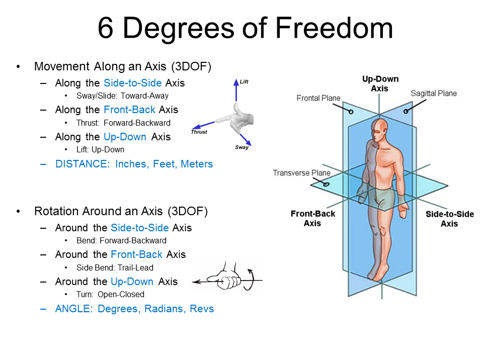
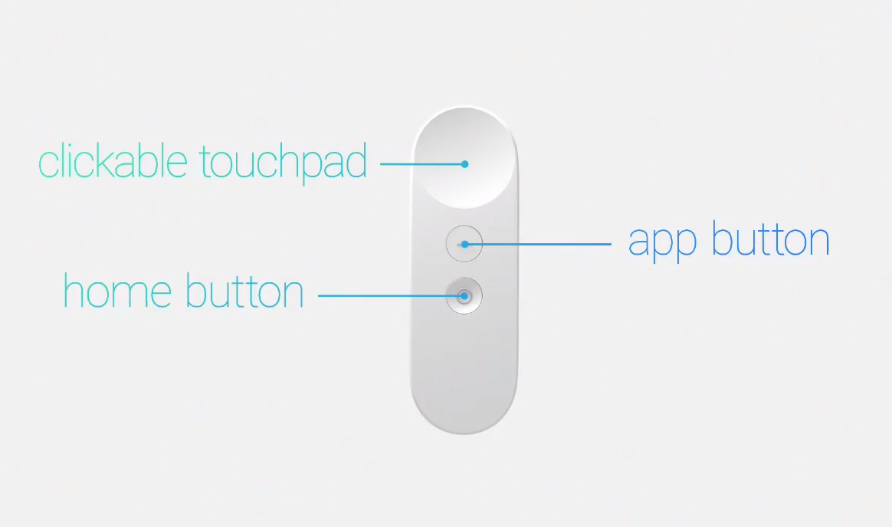

## Session IV: Attaching User Controls
* overview of controller sdks
* grabbing a simple object
* grabbing a sword
* setting up two-handed grab

### Overview of Controller SDKs

There are three major options for VR controls:

* Vive Controllers
* Oculus Touch Controllers
* Gaze + Click

All of these options can be managed through VRTK. If you don't have controllers, the simplest way to follow along is by using the SDK switcher setup.

VRTK has some major changes between versions `1/2` and `3` so if you are searching for help or tutorials, make sure that its for a recent version.

Controllers provide input in the form of position and rotation, joystick/trackpad/button presses, and an identifier (typically an integer) to tell various controllers apart.

### VRTK Quickstart (with version 3.2.1)

- Install the `.unitypackage` files (or Asset store imports) for the SDKs you want to support (probably SteamVR, Oculus, Daydream, and/or GearVR) - it is important that you *make this choice in advance*, since once you start importing VRTK assets, they will begin configuring things - if you add additional assets afterward, you may need to delete VRTK manager assets and re-add them to the Assets directory and scene
- Find the SDKSetups prefab (`VRTK/Examples/ExampleResources/Prefabs/SDKSetups.prefab`) and add it to your scene
- Find the SDKSetupSwitcher prefab (`VRTK/Examples/ExampleResources/Prefabs/SDKSetupSwitcher.prefab`) and add it to your scene
- Create an empty object and name it `[VRTK_Manager]`
- Find the script component VRTK_SDKManager (`VRTK/Scripts/Utilities/SDK/VRTK_SDKManager.cs` ) and add it to the manager object you just created
- In the VRTK_SDKManager script menu scroll to the Setups section and click 'Autopopulate'
- If you have another camera in the scene, click it in the Hierarchy and uncheck the `Audio Listener` in the Inspector to disable it

If you still experience issues, check that your SDK is enabled in the PlayerSettings `Edit > Project Settings > Player` and find `Other Settings` - there should be a checkbox next to `Virtual Reality Supported` (you can also check this by opening your project directory `./ProjectSettings/PlayerSettings.asset` in your favorite text editor, provided you have previously set your editor to store everything in 'Force to Text' mode).

In the VRTK manager in the Inspector, you should see several grayed out options and at least one in black: `Simulator (VRKT_SDKSetup)` - this is great because it means you can test things out from a desktop without a Head Mounted Display attached. You'll also find that if you import the SDKs from various vendors, those will become available as options. Whichever is listed highest will get loaded first if it is available - you can drag them around to reorder or use the SDKSetupSwitcher to change on the fly in the editor.


### Test the Controls in Simulator Mode

If you've ever used the text editor vim, Simulator Mode's basic approach will be familiar. There are a variety of input modes that determine what actions the keyboard and mouse will perform in the scene. You can navigate with WASD keys. Initially, your mouse controls the Head Mounted Display. To operate the controllers, hit `LeftAlt` to enter controller mode. Now you're controlling the position of the controller and can simulate button presses, with T, mouse-1, mouse-2, etc. Holding down shift will let you rotate the controller. If you don't see the full list of control options in the upper left of the Game View, hit `F1` .

If you have trouble getting your controller to move exactly where you need it to (to test a touch control, for instance), you can cheat by selecting `SDKSetups>Simulator>VRSimulatorCameraRig>RightHand` in the Hierarchy view and moving the RightHand object to the right place in Scene View. Note: you need to make sure to use the RightHand or LeftHand parent objects, not the Hand or ControllerAlias children.  

Developing with keyboard shortcuts can seem clunky, but comes in handy if you need to work away from your main rig or want to test something without picking up and putting down the controller multiple times. But the real power to immerse users in a scene comes from having a good set of options attached to high-quality controllers.

### Physical Controllers

Controllers are described in terms of their 'degrees of freedom', sometimes abbreviated 'DOF'. So if you hear someone describe hardware as 3-DOF or 6-DOF, they're usually talking about how hardware is tracked in space. If you can move in x,y,z that's three degrees. If you can rotate side-to-side, up-down, and front-back that's another three degrees.

Here is an example from [Phil Cheetham's site on biomechanics](http://www.philcheetham.com):



#### Vive Notes


[Unity Documentation: Vive controller details](https://docs.unity3d.com/Manual/OpenVRControllers.html)

#### Oculus Notes

[getting started blog post (2017-01-03)](https://skarredghost.com/2017/01/03/getting-started-with-oculus-touch-and-avatar-sdk-in-unity/)


[Unity Documentation: Oculus controller details](https://docs.unity3d.com/Manual/OculusControllers.html)


#### GoogleVR Notes

You can do Google VR development on most mid-to-high range Android an IOS phones, but the controller is only available on Daydream devices. Unlike the 6-dof you get with Vive or Oculus, the Daydream controller has only 3:
- move up-down,
- move left-right
- rotate along a single axis



[GVR in Unity Documentation](https://developers.google.com/vr/unity/controller-basics)

### Configuring Controllers With VRTK

VRTK provides a lot of options for some standard VR conventions like pointers, teleportation, UI interactions, and button configurations with well-written and documented scripts. We can't cover all of them here, but working through how grabbing works should give you a good start.

#### Setup the Controller Aliases

Once you've got the `VRTK_Manager` setup (if you don't, go back to the VRTK quickstart), you'll need to create an alias for the controller scripts so that the manager can swap between hardware configurations seamlessly.

- Create an empty object and rename it `[VRTK_Scripts]`
- Add an empty object and name it `LeftControllerAlias`
- Add the following components: `VRTK_ControllerEvents`, `VRTK_InteractTouch`, and `VRTK_InteractGrab`
- Duplicate the `LeftControllerAlias` (also as a child of `[VRTK_Scripts]`) and rename it `RightControllerAlias`
- Click on the `[VRTK_Manager]` in the Hierarchy view and examine `VRTK_SDKManager` script in the Inspector and drag the alias objects to the correct slots for the Script Aliases

#### Make Objects Interactable

To make an object interactable, we need a Rigidbody and several supporting scripts.

- Create a new GameObject (like a Cube or a Cylinder)
- Add Component: Rigidbody
- Add Component: VRTK_InteractableObject
- Add Component: VRTK_InteractHaptics
- Add Component: VRTK_ChildOfControllerGrabAttach

Try that now and test it in a headset or with the simulator. If you find that the objects stay stuck to your controller even when you let go, find the InteractableObject script on the object you want to grab and make sure that `Hold Button To Grab` is checked.

To save yourself some effort in the future, there is menu that will add these components to an object under `Window > VRTK > Setup Interactable Object`. You can read the details about how this works in the script `VRTK_ObjectSetup.cs`

Setting up the grab for the sword works basically the same way, except we may want to add some additional nuances:

- Add a custom collider for the parent object where the handle belongs.
- Add a Capsule Collider component and adjust its position and size using the menu in the Inspector.
- If you don't want to pick up your sword off the floor every time, you may also want to find the Rigidbody and disable gravity for the sword.
- while you are at it, find the pillar prefab in `pre_assets` and add it to the center of your scene as a convenient place for your sliceable objects

#### Customizing Grab Actions

Once you've got the basic grab action working, you'll probably have some ideas for how you want the object to behave once you've grabbed it. You can think about customization in two parts: the controller and the object you are grabbing.

For the controller, you can modify things like which buttons get mapped to which actions, how much precision to use, custom attach points, or custom event handlers.

For the object you can modify things like the color the object turns to indicate that it has been grabbed, which controllers are allowed to grab it, and how the object will respond when grabbed. For objects being picked up 'Child of Controller' usually works well. If you try the basic interaction with most objects you'll probably see a strange effect where the object jumps into the center of the controller. One way to make that work better is using a 'Snap Handle' to designate a particular place on the object where grabbing should take place.

For the sword, we could use that technique, but since we want this interaction to be pretty dynamic and we're not really worrying about performance cost, click the 'Precision Grab' checkbox to allow fine-grained control.

#### Adding Secondary Grab Actions

As an initial secondary action, we'll implement a function that makes a two-handed swing more powerful. To do so, we'll first detect when a user is grabbing the sword with two hands and then update the properties of the blade in the `BladeController` script to make it powerful enough to cut "strong" objects that we prevented the sword from slicing with a single-hand grip. At first powering up the sword won't be obvious to the user, but we'll fix that with some visual and audio effects in the final section.

To make an object behave differently when grabbed with two controllers, there are several options provided by VRTK: `SwapController` (move the object from left to right hand), `AxisScale` (resize the object), and `ControlDirection` (rotate the object). For our powerup option we want a slightly different behavior so we'll extend the ControlDirection class to insert our own effects.

Select the handle object in the Hierarchy view and Add Component. Type 'SwordPowerUp' and agree to create a new script. We'll extend the existing `ControlDirection` script (if you want to see the full details, open the `VRTK_ControlDirectionGrabAction.cs` file) and override a few of the functions we care about

```
namespace VRTK.SecondaryControllerGrabActions {
	using UnityEngine;
	using System.Collections;

	[AddComponentMenu("VRTK/Scripts/Interactions/Secondary Controller Grab Actions/PowerUpSword")]
  [RequireComponent(BladeController)]
	public class PowerUpSword : VRTK_ControlDirectionGrabAction {

		public override void Initialise(VRTK_InteractableObject currentGrabbdObject, VRTK_InteractGrab currentPrimaryGrabbingObject, VRTK_InteractGrab currentSecondaryGrabbingObject, Transform primaryGrabPoint, Transform secondaryGrabPoint){
			base.Initialise(currentGrabbdObject, currentPrimaryGrabbingObject, currentSecondaryGrabbingObject, primaryGrabPoint, secondaryGrabPoint);
			isPoweredUp = true;
			Debug.Log ("Powerup!!!");
		}

		public override void ResetAction(){
			Debug.Log ("PowerUpSword>ResetAction: Back to normal power");
			base.ResetAction();
		}

		public override void OnDropAction(){
			base.OnDropAction();
			Debug.Log ("PowerUpSword>DropAction: Back to normal power");
		}
	}
}
```

In order to connect this to a controller action, you need to point the `InteractableObject` script on the Sword to its own custom Grab Action script, `PowerUpSword`. The easiest way to do this is in the Inspector by dragging the c# script icon for `PowerUpSword` to the `Secondary Grab Action Script` slot in the `InteractableObject` menu. If you get weird behaviors, check to make sure the handle is oriented along the z axis with the point of the sword towards negative z (opposite the blue arrow) since this is what VRTK's `DirectionGrabAction` expects.

Once you've got the powerup working as a log message and a boolean variable, we'll set things up to modify the how the blade works in Collisions.

Set up a reference to the `BladeController` script:

```
private BladeController bladeController;
```

Lookup and assign the bladeController.

```
bladeController = GetComponent<BladeController>();
```

Then, open up `BladeController.cs` and add two public functions:

```
public void EnablePowerUp(){
    Debug.Log("BladeController>EnablePowerUp");
}

public void DisablePowerUp(){
    Debug.Log("BladeController>DisablePowerUp");
}
```

Then, go back to the `PowerUpSword.cs` script and add calls to the public functions in the `BladeController` in the appropriate places:

```
bladeController.EnablePowerUp();
```

```
bladeController.DisablePowerUp();
```

If you get the log messages coming from both `PowerUpSword` and `BladeController` congratulations! You've got just one more step to change the sword's behavior for two-handed swings:

Go back to the `BladeController` and create a boolean variable to handle its state:

```
bool isPoweredUp = false;
```

Set the state to true in `EnablePowerUp` and false in `DisablePowerUp`.

Then in `OnCollisionEnter` add a check to see if the sword is, in fact, powered up. When the sword is powered up, let the sword slice objects that are tagged `Strong` as well as those that are tagged `Sliceable`. You can test this by slicing the pillar or any other object you've tagged `Strong`.
